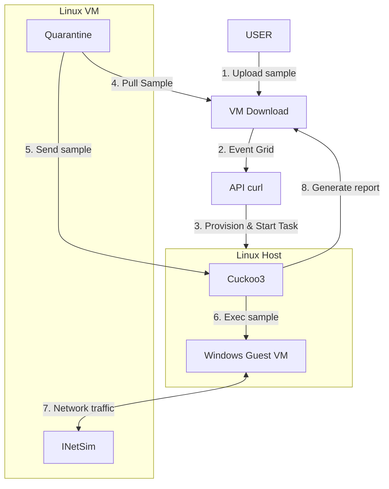
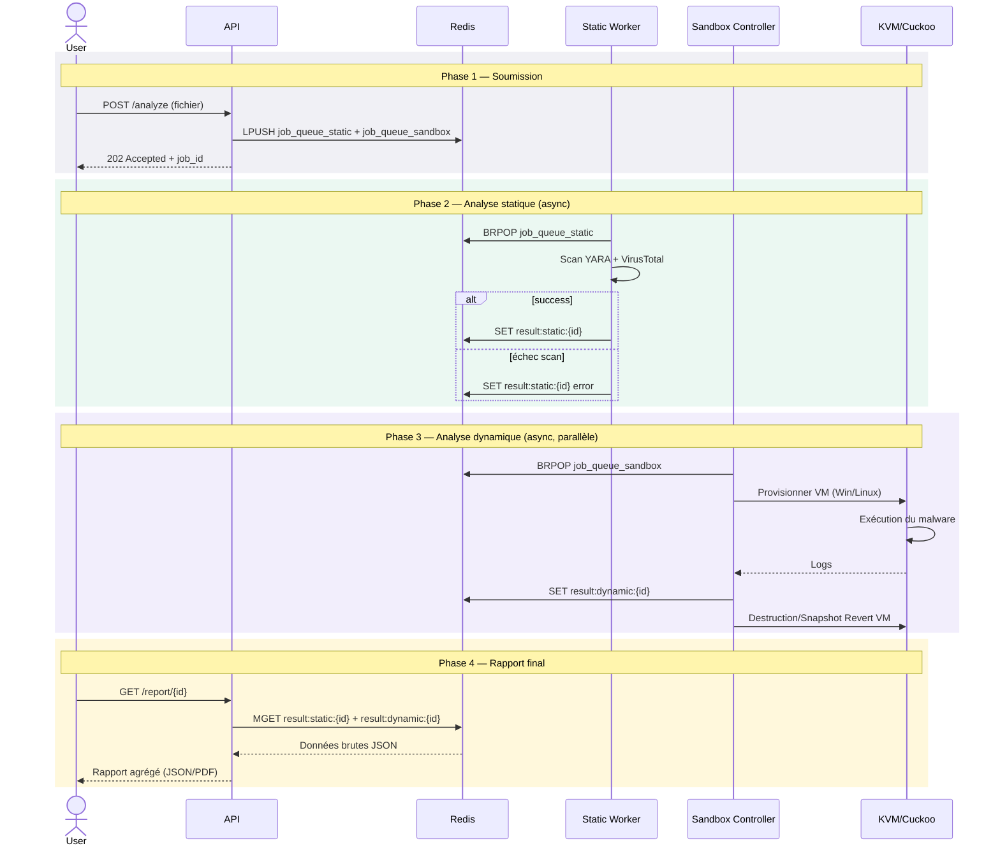
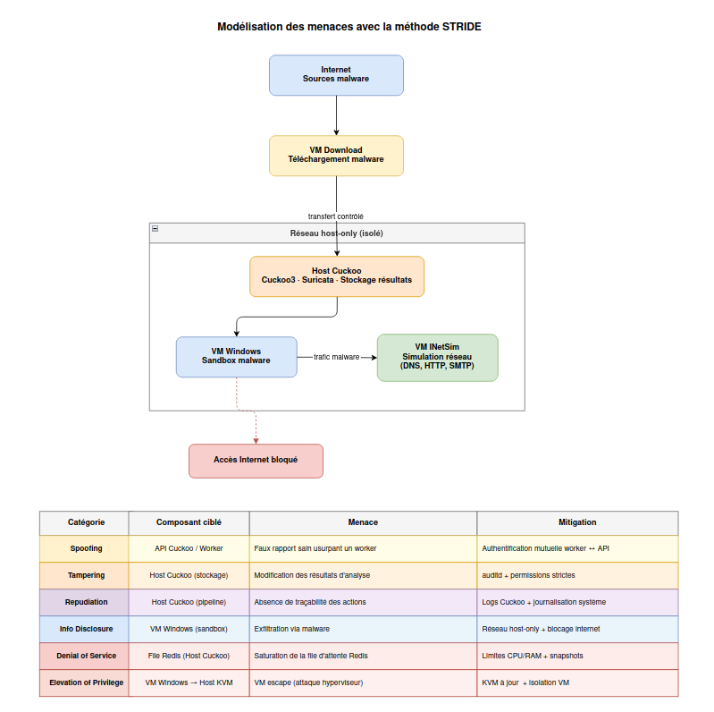

# PFE





## Sequence Diagram



## Threat modeling diagram 




# Projet d'analyse de malware

## Présentation

Ce projet est une plateforme distribuée d’analyse de malwares reposant sur Kubernetes.
Elle permet de soumettre un fichier, d’effectuer une analyse statique et dynamique, puis de générer un rapport en JSON et en PDF.

### Composants principaux
- API FastAPI : soumission, orchestration, résultats, UI
- Workers statiques : analyse VirusTotal / YARA
- Workers dynamiques : analyse en sandbox Windows et Linux
- Sandbox-controller : gestion des VM d’analyses
- Redis : file de jobs et stockage des résultats
- Kubernetes (k3s) : orchestration

### Installation et déploiement automatisé du projet :
```bash
git clone https://github.com/na-teag/PFE.git
cd PFE
./setup.sh
```

Le script setup.sh :

- installe les dépendances nécessaires (Terraform, Firefox si absent)

- déploie une VM avec k3s et une VM avec ebpf via libvirt/virt-install

- installe et configure [Cuckoo3 Sandbox](https://github.com/cert-ee/cuckoo3) sur une VM

- déploie la VM qui héberge Cuckoo3

- déploie les services Kubernetes

- initialise les secrets (VirusTotal, Cuckoo API et la clé API)

- ouvre automatiquement l’interface web

Pré-requis :

- environnement Linux

- virtualisation activée (KVM / libvirt)

- ~40Go de disponible (le script vous avertira au préalable s'il manque de la place)

- accès sudo

### Limitations

- Le projet a été conçu pour utiliser terraform, mais suite à beaucoup de difficultés (erreur de provider en tout genre, documentation incomplète, erreur de création de réseau, VM non bootable, pas d'accès console, ...), Terraform a été abandonné au profit de commandes virt-install.
- Le projet prévoyait initialement d'utiliser [Drakvuf](https://drakvuf.com/) en tant que sandbox, mais suite à des difficultés d'installation/utilisation due à la contrainte de ne pas pouvoir utiliser [Xen](https://xenproject.org/), nous avons choisi d'utiliser Cuckoo3 et une VM configurée manuellement pour les analyses sur Linux.
- Le projet actuel ne permet pas de traiter plusieurs analyses simultanément, bien qu'un système de queue soit en place.
- Les analyses se font seulement sur Windows 10 (car cuckoo3 ne prend pas encore en charge windows 11) ou sur Ubuntu 22.04 (facile à changer dans le fichier [install-vm-k3s.sh](/script/install-vm-k3s.sh), l.79. Les arguments `os-variant` dans le même fichier l.91 et dans [build_vm.sh](/infra/packer/linux/dynamic-worker/build_vm.sh) l.19 seraient aussi à changer).

### Accès à l’interface

Par défaut, les services sont exposés via la VM k3s connectée au réseau libvirt via l'interface virbr0.

- Interface web API : https://192.168.122.2/ 
A noter qu'une clé API est requise pour accéder à l’interface web de l'API. Elle est générée à la fin du script d’installation.

- Documentation Swagger : https://192.168.122.2/docs

L’interface web permet de soumettre des fichiers, de suivre les analyses et de consulter les rapports directement depuis le navigateur.
La VM k3s utilise l'adresse IP statique 192.168.122.2 configurée via cloud-init. 
La VM cuckoo utilise l'adresse IP statique 192.168.122.3 également configurée via cloud-init. 
Cette configuration garantit un accès stable et reproductible aux services, indépendamment de la machine hôte ou des redémarrages.

### Documentation complète

Toutes les informations détaillées (infrastructure, VM, Packer, Docker, tests, dépannage) sont disponibles dans le dossier /doc :
- [INFORMATIONS.md](/docs/INFORMATIONS.md)
- [ARCHITECTURE.md](/docs/ARCHITECTURE.md)

### Licence et règles YARA

Ce projet utilise des règles yara sous licence GPL-2.0 : [rules](https://github.com/Yara-Rules/rules)
