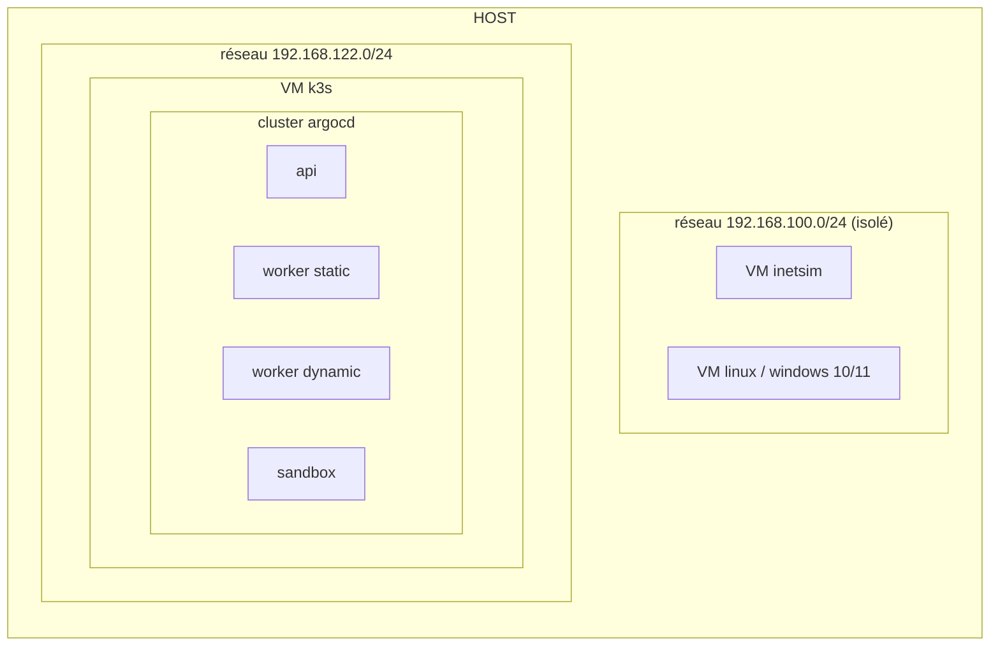
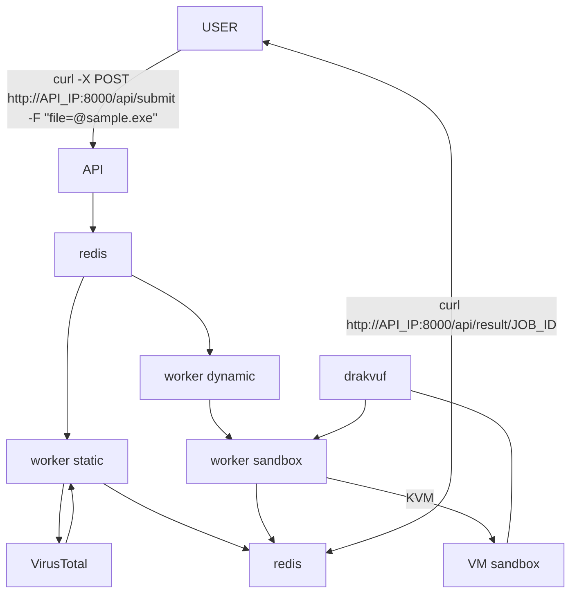
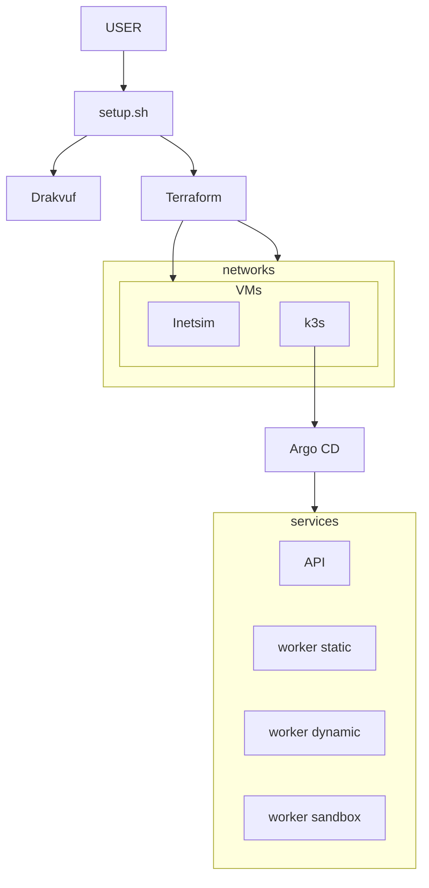

## Diagramme structurel

## Workflow

 

## Installation worflow

 

### tree
.  
├── docs  
│      ├── ARCHITECTURE.md  
│      └── SANDBOX.md  
├── infra  
│      ├── agocd  
│      │      └── malware-analysis-app.yaml  
│      └── terraform  
│           ├── network-external.tf  
│           ├── network-sandbox.tf  
│           ├── outputs.tf  
│           ├── pool.tf  
│           ├── provider.tf  
│           ├── terraform.tfstate  
│           ├── terraform.tfstate.backup  
│           ├── variables.tf  
│           ├── vm-inetsim.tf  
│           ├── vm-inetsim.yaml  
│           ├── vm-k3s.tf  
│           └── vm-k3s.yaml  
├── k3s  
│      ├── api-deployment.yaml  
│      ├── configmap-yara.yaml  
│      ├── kustomization.yaml  
│      ├── namespace.yaml  
│      ├── pvc.yaml  
│      ├── redis.yaml  
│      ├── sandbox-controller-deployment.yaml  
│      ├── secrets.yaml  
│      ├── services.yaml  
│      ├── worker-dynamic-deployment.yaml  
│      └── worker-static-deployment.yaml  
├── README.md  
├── script  
│      ├── sandbox-firewall.sh  
│      └──  setup-env.sh  
├── services  
│      ├── api  
│      │      ├── Dockerfile  
│      │      ├── main.py  
│      │      └── requirements.txt  
│      ├── sandbox  
│      │      └── controller  
│      │           ├── Dockerfile  
│      │           ├── main.py  
│      │           └── requirements.txt  
│      ├── worker-dynamic  
│      │      ├── Dockerfile  
│      │      ├── main.py  
│      │      └── requirements.txt  
│      └── worker-static  
│           ├── Dockerfile  
│           ├── main.py  
│           └── requirements.txt  
├── setup.sh  
├── .env.example  
├── .gitignore  
└── yara-rules  
       ├── index.yar  
       ├── ...  
       ...  
