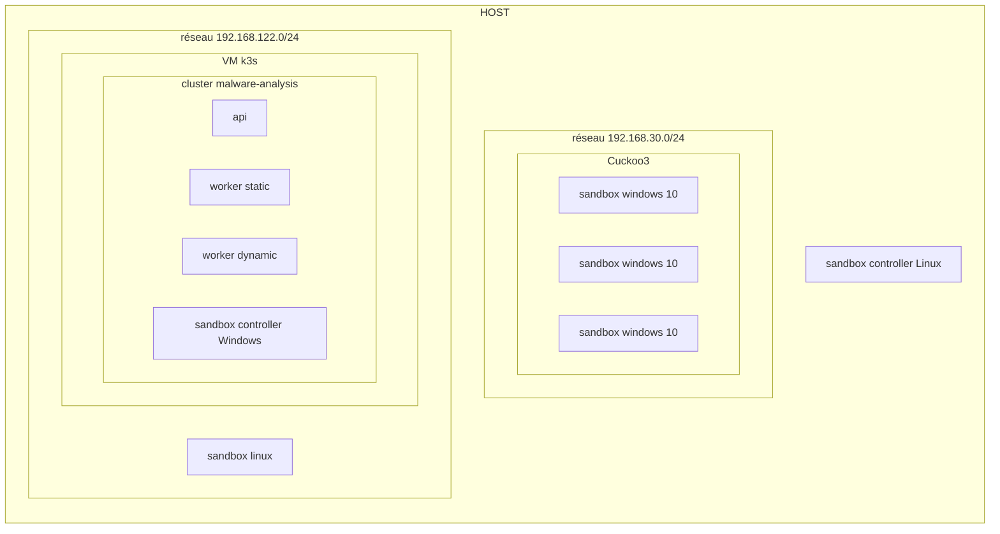
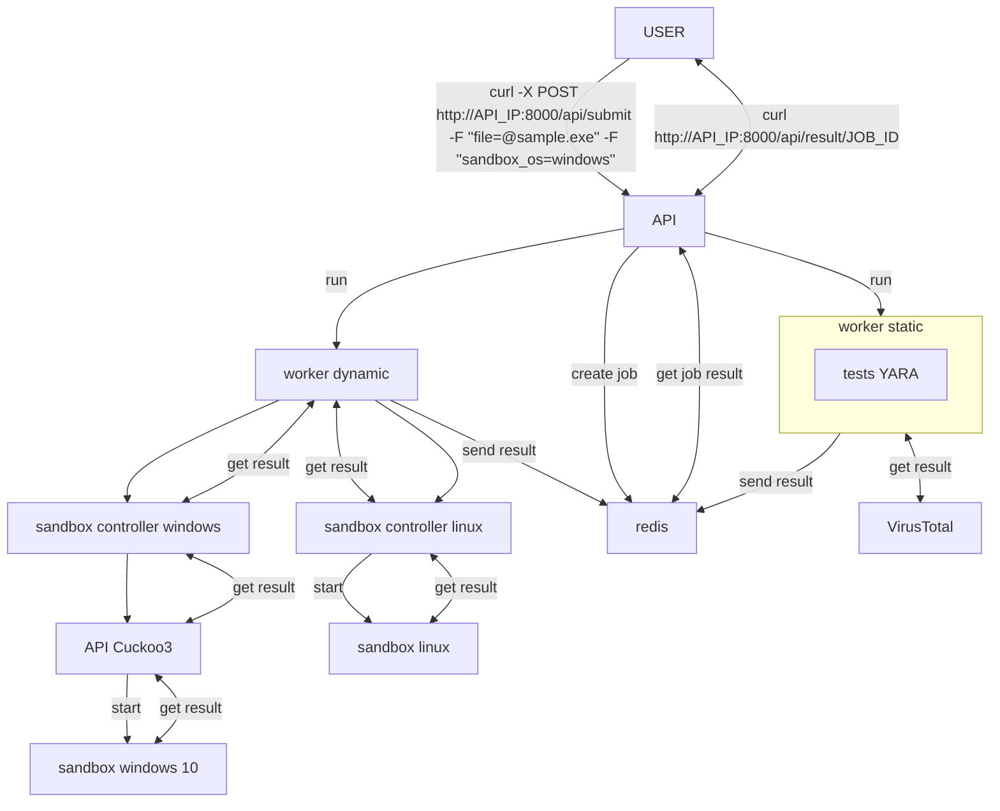
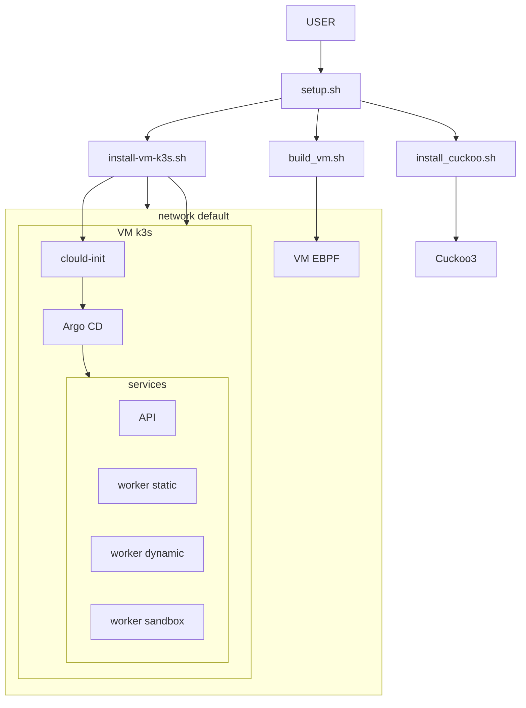

## Diagramme structurel

```mermaid
flowchart LR
    
subgraph HOST
    subgraph R3[réseau 192.168.30.0/24]
        subgraph Cuckoo3
            VM1[sandbox windows 10]
            VM2[sandbox windows 10]
            VM3[sandbox windows 10]
        end
    end

    subgraph R2[réseau 192.168.122.0/24]
        VM4[sandbox linux]
        subgraph VM5[VM k3s]
            subgraph C[cluster malware-analysis]
                P1[api]
                P2[worker static]
                P3[worker dynamic]
                P4[sandbox controller Windows]
            end
        end
    end
    script[sandbox controller Linux]

    click Cuckoo3 "https://github.com/cert-ee/cuckoo3" "Cuckoo3" _blank
end
```

## Workflow

```mermaid
flowchart TD    
    USER-->|curl -X POST http://API_IP:8000/api/submit -F ''file=@sample.exe'' -F ''sandbox_os=windows''|API
    subgraph worker1[worker static]
        tests[tests YARA]
    end
    API -->|run| worker1
    worker1 -->|send result| redis
    worker1 <-->|get result| VT[VirusTotal]
    API -->|run| worker2[worker dynamic]
    API -->|create job| redis
    worker2 --> controller_windows[sandbox controller windows]
    controller_windows --> cuckoo[API Cuckoo3]
    controller_linux -->|start| sandboxebpf[sandbox linux]
    controller_linux <-->|get result| sandboxebpf
    cuckoo -->|start| sandbox[sandbox windows 10]
    cuckoo <-->|get result| sandbox
    controller_windows <-->|get result| cuckoo
    worker2 <-->|get result| controller_windows
    worker2 <-->|get result| controller_linux
    worker2 --> controller_linux[sandbox controller linux]
    USER <-->|curl http://API_IP:8000/api/result/JOB_ID| API
    API <-->|get job result| redis
    worker2 -->|send result| redis
    click VT "https://virustotal.com" "VirusTotal" _blank
    click redis "https://redis.io/" "redis" _blank
    click cuckoo "https://github.com/cert-ee/cuckoo3" "API Cuckoo3" _blank
   
```
 

## Installation worflow

```mermaid
flowchart TD
    USER --> setup.sh
    setup.sh --> install-vm-k3s.sh
    setup.sh --> build_vm.sh
    setup.sh --> install_cuckoo.sh
    install_cuckoo.sh --> Cuckoo3
    subgraph network[network default]
            subgraph k3s[VM k3s]
                subgraph services
                    API
                    worker1[worker static]
                    worker2[worker dynamic]
                    worker3[worker sandbox]
                end
                Argocd[Argo CD] --> services
                clould-init
            end
            EBPF[VM EBPF]
    end
    install-vm-k3s.sh --> clould-init
    clould-init --> Argocd
    install-vm-k3s.sh --> network
    install-vm-k3s.sh --> k3s
    build_vm.sh --> EBPF
    
    
    click Cuckoo3 "https://github.com/cert-ee/cuckoo3" "Cuckoo3" _blank
    click Terraform "https://.terraform.io/" "Terraform" _blank
    click Argocd "https://argo-cd.readthedocs.io" "Argo CD" _blank
```

