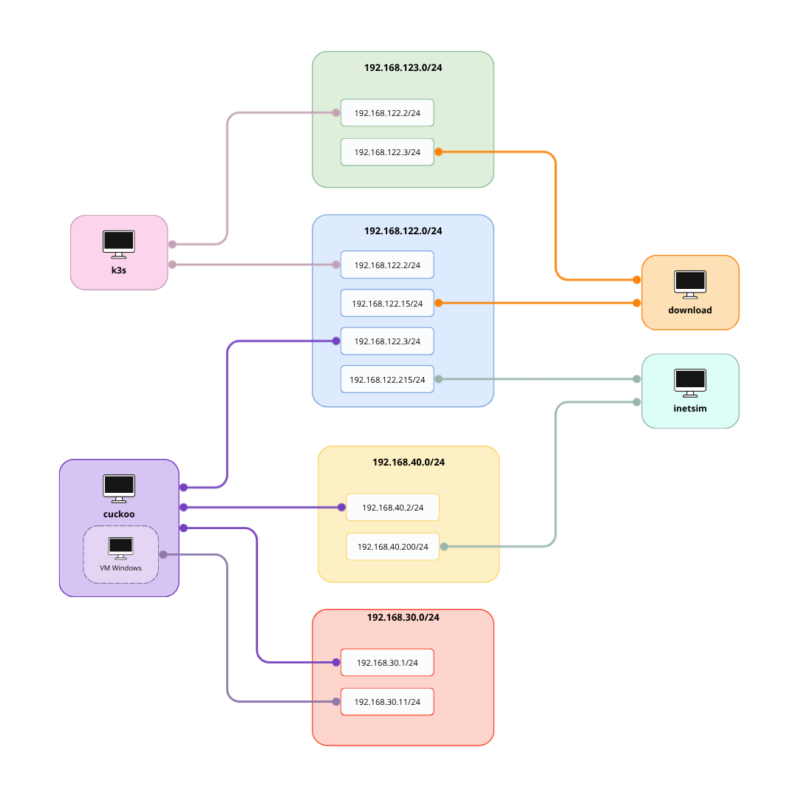
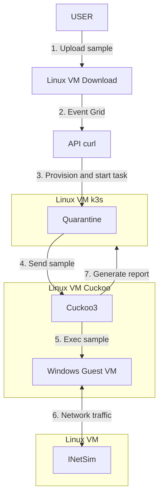
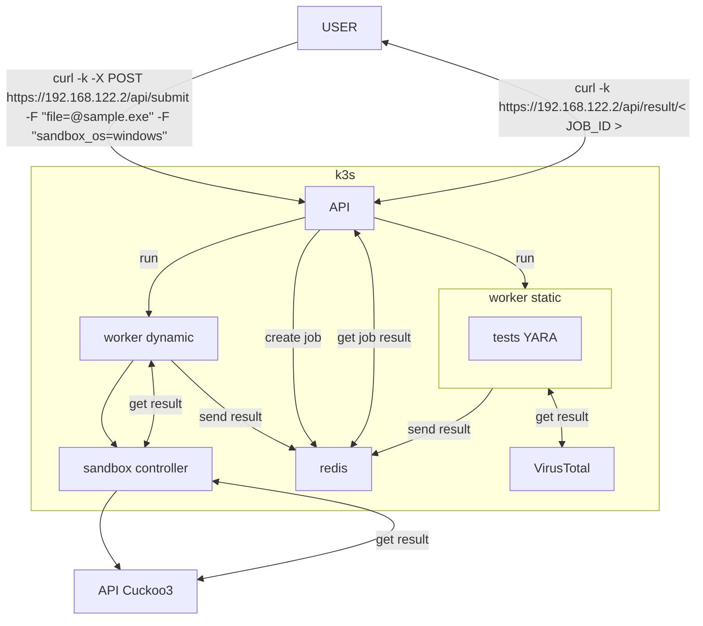
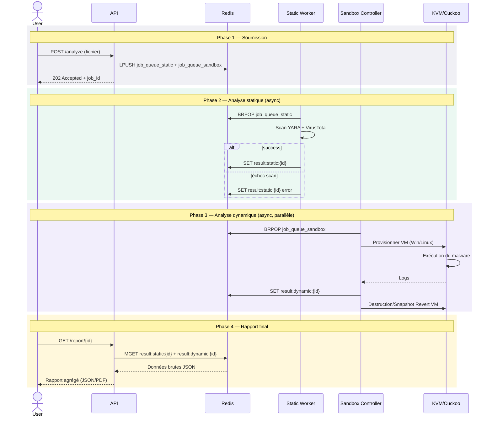

## Network Diagram

## Workflow

```mermaid
flowchart TB
    USER -->|1. Upload sample| BLOB[Linux VM Download]
    BLOB -->|2. Event Grid| FUNC[API curl]

    subgraph LINVIM[Linux VM k3s]
        QUARANTINE[Quarantine]
    end

    subgraph LINVM2[Linux VM Cuckoo]
        CUCKOO[Cuckoo3]
        WINVM[Windows Guest VM]
    end

    subgraph LINVM3[Linux VM]
        INETSIM[INetSim]
    end
        
    FUNC -->|3. Provision and start task| QUARANTINE
    QUARANTINE -->|4. Send sample| CUCKOO
    CUCKOO -->|5. Exec sample| WINVM
    WINVM <-->|6. Network traffic| INETSIM
    CUCKOO -->|7. Generate report| LINVIM

```

## Workflow k3s

```mermaid
flowchart TD    
    USER-->|curl -k -X POST https://192.168.122.2/api/submit -F ''file=@sample.exe'' -F ''sandbox_os=windows''|API
    
    subgraph k3s
        
        subgraph worker1[worker static]
            tests[tests YARA]
        end
        API -->|run| worker1
        worker1 -->|send result| redis
        worker1 <-->|get result| VT[VirusTotal]
        API -->|run| worker2[worker dynamic]
        API -->|create job| redis
        worker2 --> controller_windows[sandbox controller]
        worker2 <-->|get result| controller_windows
        API <-->|get job result| redis
        worker2 -->|send result| redis

    end
    USER <-->|curl -k https://192.168.122.2/api/result/< JOB_ID >| API
    controller_windows --> cuckoo[API Cuckoo3]
    controller_windows <-->|get result| cuckoo
    
    click VT "https://virustotal.com" "VirusTotal" _blank
    click redis "https://redis.io/" "redis" _blank
    click cuckoo "https://github.com/cert-ee/cuckoo3" "API Cuckoo3" _blank

```

## Sequence Diagram

```mermaid
%%{init: {'theme': 'light'}}%%
sequenceDiagram
    actor User
    participant API
    participant Redis
    participant Static Worker
    participant Sandbox Controller
    participant KVM/Cuckoo

    
    rect rgb(240, 240, 245)
        Note over User,KVM/Cuckoo: Phase 1 — Soumission
        User->>API: POST /analyze (fichier)
        API->>Redis: LPUSH job_queue_static + job_queue_sandbox
        API-->>User: 202 Accepted + job_id
    end

    
    rect rgb(235, 248, 242)
        Note over User,KVM/Cuckoo: Phase 2 — Analyse statique (async)
        Static Worker->>Redis: BRPOP job_queue_static
        Static Worker->>Static Worker: Scan YARA + VirusTotal
        alt success
            Static Worker->>Redis: SET result:static:{id}
        else échec scan
            Static Worker->>Redis: SET result:static:{id} error
        end
    end

    rect rgb(242, 238, 252)
        Note over User,KVM/Cuckoo: Phase 3 — Analyse dynamique (async, parallèle)
        Sandbox Controller->>Redis: BRPOP job_queue_sandbox
        Sandbox Controller->>KVM/Cuckoo: Provisionner VM (Win/Linux)
        KVM/Cuckoo->>KVM/Cuckoo: Exécution du malware
        KVM/Cuckoo-->>Sandbox Controller: Logs
        Sandbox Controller->>Redis: SET result:dynamic:{id}
        Sandbox Controller->>KVM/Cuckoo: Destruction/Snapshot Revert VM
    end

    
    rect rgb(255, 248, 220)
        Note over User,KVM/Cuckoo: Phase 4 — Rapport final
        User->>API: GET /report/{id}
        API->>Redis: MGET result:static:{id} + result:dynamic:{id}
        Redis-->>API: Données brutes JSON
        API-->>User: Rapport agrégé (JSON/PDF)
    end


```

## Threat modeling diagram

